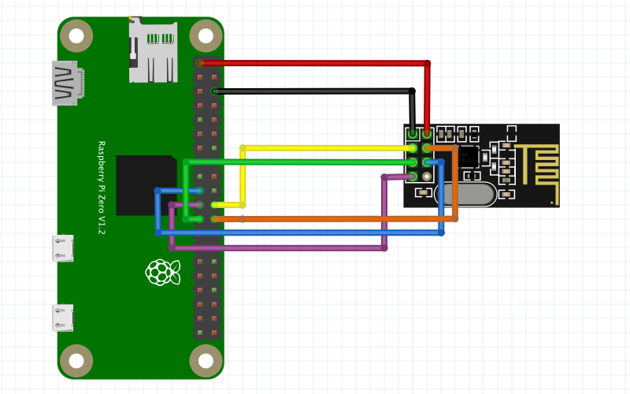

# Schubvektorsteuerung

Simple overview of use/purpose.

## Description

Das Programm beinhaltet eine Schnittstelle mit einem NRF24l01+ Modul und zwei RPIs. In diesem Programm wird die Kommunikation und die Steuerung eines Modelles mit einer Schubvektorsteuerung erstellt.

## Getting Started

### Hardwear

* RASPBERRY PI * 2
* NRF24l01 + * 2
* I2C MPU9250
* Display for Raspi
* Ps4 controller

### Installing

* Just download
* install requirements.txt
* setup Bluethooth
* connect display to master Raspi

## wire the circut


| PIN               | GPIO  | MPU 925 | NRF24              | Servo check if  5V | ESC  |   |
|-------------------|-------|---------|--------------------|--------------------|------|---|
| 1                 | 3V    |         |                    |                    |      |   |
| 3                 | 2/I2C | SDA     |                    |                    |      |   |
| 2                 | 5V    |         |                    | if 5V              | 5V   |   |
| 5                 | I2C   | SCL     |                    |                    |      |   |
| 6                 | GND   | GND     | GND                | GND                | GND  |   |
| Choose a free pin |       |         |                    | Data               | Data |   |
|                   |       |         | connect like image |                    |      |   |

* Wire the NRF modules exact like this:



* test it

### Executing program

* How to run the program
* install requirements
```
pip install -r requirements.txt
```
or
```
pip3 install -r requirements.txt
```
or
```
python3 -m pip install -r requirements.txt
```

## Authors

Contributors names and contact info

ex. Noah-Retro

## Version History

* 0.1
    * In work

## Acknowledgments

Inspiration, code snippets, etc.
* [DomPizzie](https://gist.github.com/DomPizzie/7a5ff55ffa9081f2de27c315f5018afc#file-readme-template-md) README.md File 
* [bjarne-hansen](https://github.com/bjarne-hansen/py-nrf24) nrf24 module
* [niru-5](https://github.com/niru-5/imusensor/tree/master) mdu9250 module
* [claymcleod](https://gist.github.com/claymcleod/028386b860b75e4f5472) code snippet ps4-controller in pygame
* [MenxLi](https://github.com/MenxLi/tkSliderWidget) Slider Class


